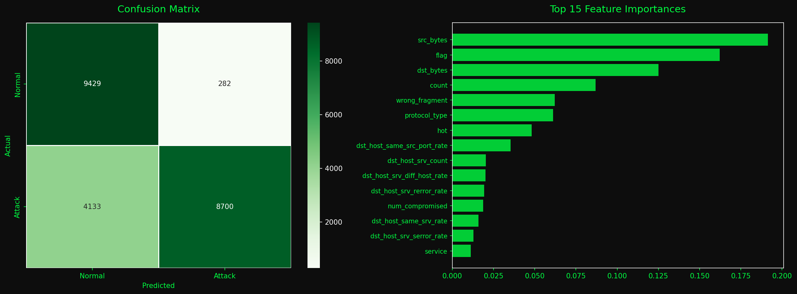

<div align="center">


</div>

---

### What is this?

IOT-SHIELD checks whether network traffic is normal or an attack. You give it network parameters, it tells you if something looks suspicious — along with a confidence score and threat level (LOW / MEDIUM / HIGH).

It was built with IoT and embedded systems in mind, where detecting unusual network behaviour early matters.

---

### How it works

1. You enter network traffic parameters into the dashboard
2. The data is sent to a Django backend
3. An XGBoost ML model analyses it
4. You get back — Normal or Attack, confidence %, and threat level

---

### Model

- **Dataset:** NSL-KDD (125,973 training samples, 23 attack types)
- **Algorithm:** XGBoost Classifier
- **Accuracy:** 80.4% on test set

> The NSL-KDD test set is intentionally harder than the training data — this is a known characteristic of the dataset, not a model issue. 80% is consistent with research benchmarks on this dataset.

<div align="center">

</div>

---

### Stack

<div align="center">


</div>

---

### Project Structure

```
iot-shield/
├── ml_model/         # Jupyter notebook, trained model (.pkl), scaler
├── backend/          # Django REST API
├── frontend/         # React dashboard
├── data/             # NSL-KDD dataset
└── assets/           # Screenshots and plots
```

---

### Setup

**1. Clone the repo**
```bash
git clone https://github.com/sahana-iyer/iot-shield.git
cd iot-shield
```

**2. Install Python dependencies**
```bash
pip install django djangorestframework django-cors-headers xgboost scikit-learn pandas numpy
```

**3. Run the backend**
```bash
cd backend
python manage.py runserver
```

**4. Run the frontend**
```bash
cd frontend
npm install
npm start
```

**5. Open** `http://localhost:3000` and start analysing traffic.

---

### API Endpoints

| Method | Endpoint | Description |
|---|---|---|
| GET | `/api/health/` | Check if the system is running |
| POST | `/api/predict/` | Submit traffic parameters for analysis |

---

<div align="center">


*Built by Sahana G Iyer*

</div>
